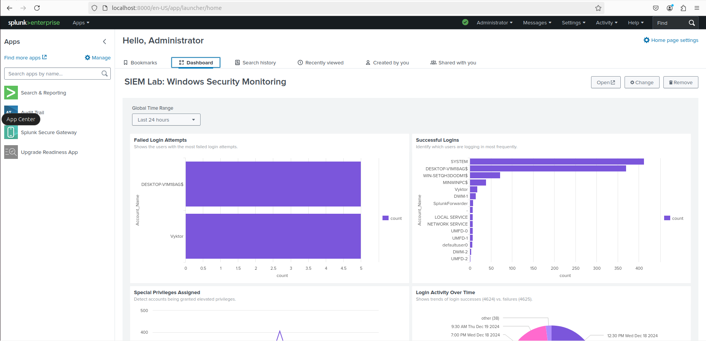

<h1>SIEM Lab</h1>
<h2>Introduction</h2>
This project is part of a SIEM lab designed to monitor Windows Event for security-related activities, such as failed login attempts, successful logins, and privilege escalations. <br />
It includes real-time alerting for potential brute-force attacks to enhance incident response capabilities.

<h2>System Setup</h2>
<h3>Technologies Used</h3>
- Oracle Virtual Box <br />
- Ubuntu LTS 24.04.1 <br />
- Windows 10 Enterprise <br />
- Splunk Enterprise 9.4.0 <br />
- Splunk Universal Forwarder <br />
- Windows Event Logs

<h3>Step 1: Virtualization Environment</h3>

1. [Download and Install Virtual Box](https://www.virtualbox.org/wiki/Downloads)
2. Set up at least two VMs:
   - [Windows 10 VM for event logs](https://www.microsoft.com/en-us/evalcenter/evaluate-windows-10-enterprise)
   - [Ubuntu VM for hosting the SIEM](https://ubuntu.com/download/desktop)

<h3>Step 2: SIEM Installation</h3>

1. Download SIEM Enterprise 9.4.0 running the following command on the Linux Terminal:

```bash
wget -O splunk-9.4.0-6b4ebe426ca6-windows-x64.msi "https://download.splunk.com/products/splunk/releases/9.4.0/windows/splunk-9.4.0-6b4ebe426ca6-windows-x64.msi"
```
2. Extract the installer:

```bash
tar -xvf splunk.tgz
```

3. Move Splunk to /opt directory:

```bash
sudo mv splunk /opt
```

4. Start Splunk for the First Time:

```bash
cd /opt/splunk/bin
sudo ./splunk start --accept-license
```

5. Set Admin Credentials:

- During the first start, you will need to set up the Splunk admin username and password.

6. Enable Splunk to Start at boot:

```bash
sudo ./splunk enable boot-start
```

<h3>Step 3: Access Splunk</h3>

1. Open a browser on your host machine. <br />

2. Go to: http://localhost:8000

<h3>Step 4: Configure Windows VM to Send Logs</h3>

1. Install Splunk Universal Forwarder:

- [Download Splunk Universal Forwarder](https://www.splunk.com/en_us/download/universal-forwarder.html) <br />
- Install and configure it to point to your Splunk server.

2. Configure the Universal Forwarder:

Now that the forwarder is installed, you will need to configure it to send specific logs (e.g., Windows Event Logs) to the Splunk server.

<h3>Step 1: Add a Forwarding Destination</h3>

1. Run the Command Prompt as Administrator <br />
2. Navigate to the Universal Forwarder directory.

```bash
cd "C:\Program Files\SplunkUniversalForwarder\bin"
```
3. Add the Splunk server as a forwarding destination:

```bash
splunk add forward-server <Splunk-IP>:9997 -auth <admin-username>:<Splunk-Password>
splunk restart
```
- This add your Splunk server as forwarding destination and restart apply the changes.

<h3>Step 2: Add Log Sources</h3>

Stay in the same folder and run the following command to add Windows Event Logs as a monitored source:

```bash
splunk add monitor "C:\Windows\System32\winevt\Logs" -sourcetype WinEventLog -auth <admin-username>:<Your-Password>
splunk restart
```
- This tells Splunk to monitor the Windows Event Logs directory, set the sourcetype as WinEvntLog so you can search it easily, and restart apply the changes.
<br />

We can check the configuration running:
```bash
splunk list monitor
splunk list forward-server
```

<h3>Step 3: Verify Logs on Splunk Enterprise</h3>
1. Open the Splunk Web Interface and go to Search & Reporting. <br />
2. Run the following search to look for Windows Event Logs:

```bash
index=* sourcetype=WinEventLog host=<Windows-Hostname>
```

3. If logs do not appear, broaden the search like so:

```bash
index=* host=<Windows-Hostname>
```

<h2>Data Ingestion</h2>
The Splunk Universal Forwarder now sends logs from the Windows Security Event Log (EventCode 4624, 4625, 4672, and others) to Splunk Enterprise. Key events include:
<br />
- Successful Logins (4624). <br />
- Failed Login Attempts (4625). <br />
- Privilege Escalation (4672).

At this point, we are going to create a Dashboard to customize exactly what we want to analize.

<h2>Dashboard Overview</h2>

 
<br />


<h3>Purpose</h3>
The Windows Security Monitoring Dashboard provides visualizations to:
- Identify user login behavior (successes and failures). <br />
- Detect suspicious patterns (e.g., multiple failed logins). <br />
- Track privileged access events.

<h3>Dashboard Panels</h3>
<table>
  <tr>
    <th>Panel Name</th>
    <th>Description</th>
    <th>Visualization</th>
  </tr>
  <tr>
  <td>Failed Login Attemps</td>
  <td>Shows the number of failed logins for each user</td>
  <td>Bar Chart</td>
  </tr>
  <tr>
  <td>Successful Logins</td>
  <td>Shows the number of successful logins for each user</td>
  <td>Bar Chart</td>
  </tr>
  <tr>
  <td>Login Activity Over Time</td>
  <td>Visualizes trends of failed and successful logins over time.</td>
  <td>Line Chart</td>
  </tr>
  <tr>
  <td>Top Security Event Codes</td>
  <td>Displays the most common Windows Security Event Codes</td>
  <td>Table</td>
  </tr>
  <tr>
  <td>High-Volume Failed Accounts</td>
  <td>Identifies accounts with a high number of failed login attempts (>5 failures)</td>
  <td>Bar Chart</td>
  </tr>
  <tr>
  <td>Privilege Escalations</td>
  <td>Highlights accounts assigned special privileges (EventCode 4672).</td>
  <td>Line Chart</td>
  </tr>
  <tr>
  <td>Event Log Source Breakdown</td>
  <td>Gives an overview of the log sources being monitored</td>
  <td>Pie Chart</td>
  </tr>
  <tr>
  <td>Account Lockouts</td>
  <td>Shows which accounts were locked out</td>
  <td>Table</td>
  </tr>
</table>

<h2>Alerts</h2>
This section outlines the configuration and functionality of the alert set up to detect potential brute-force attacks by monitoring multiple failed login attempts. <br />
